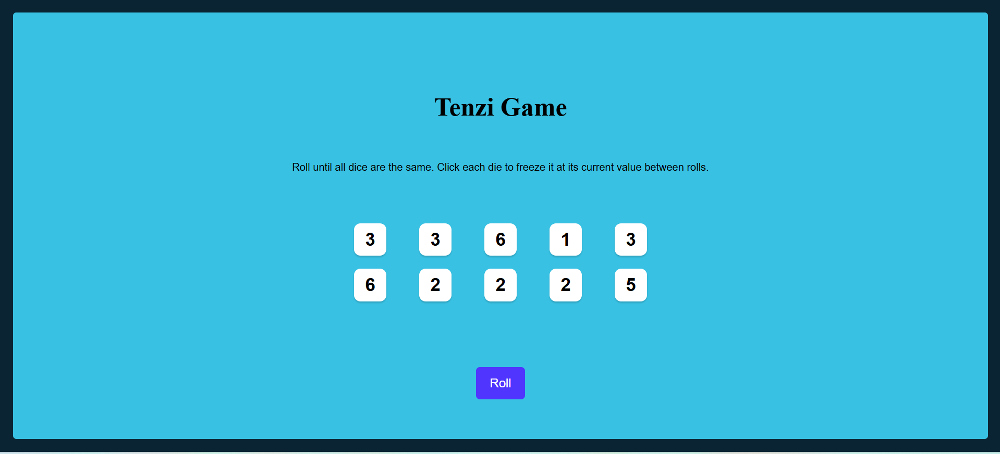
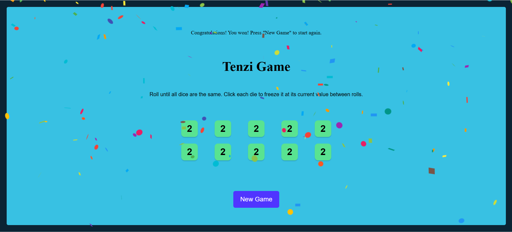

# Tenzi Game 🎲

A fun and interactive dice game built with React, where players race to get all their dice to show the same number.

## 🔧 Tech Stack
- React.js
- JavaScript
- HTML/CSS

## ✨ Features
- Roll dice and keep track of the ones that match
- Speed-based gameplay
- Responsive design for mobile and desktop

## 🚀 How to Play
1. Click "Roll Dice" to roll the dice 🎲
2. Hold any dice you want to keep by clicking them
3. Keep rolling until all dice match! 🎉
4. Once all dice match, the game is won!

## 📁 Folder Highlights
- `App.js` – Main game container
- `Dice.js` – Displays individual dice and their states

## 🔗 Live Demo
👉 [Click to try it](https://tenzie-dice-game-myreactapp-chirag.netlify.app)

## 📸 Screenshot
<!-- You can upload a screenshot here later -->

## 📬 Contact
**H M Chirag**  
📧 chiragshettyhm@gmail.com
